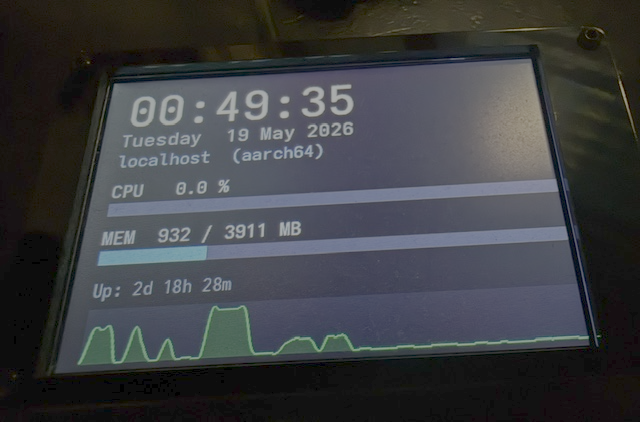

# lcd2

A modern, C++23 rewrite of [lcd4linux](https://lcd4linux.bulix.org/) for Linux display systems.
The application renders information widgets onto framebuffer displays using DRM/KMS or USB display drivers.

> **Working name:** The project could also have been called *tft4linux*, but *lcd2* stuck as the working name.

## Features

- **DRM/KMS driver** — primary display backend; works with any kernel DRM device (`/dev/dri/card*`)
- **Flexible widget system** — TTF text, bar graphs, line/curve charts, gauge dials, analog clock, images
- **Expression engine** — values and labels are arbitrary expressions: `cpu::load() * 2`, `'Used: ' . format(mem::used('mb'), 0) . ' MB'`
- **Plugin data sources** — CPU, memory, network, filesystem, uptime, hostname, exec, file reads
- **Optional ubus support** — fetch data from OpenWrt's ubus IPC bus (built with `WITH_UBUS=1`)
- **Multi-page layout** — define multiple pages, switch between them with actions
- **Configurable timers** — each widget refreshes independently at its own interval



## Quick Start

```sh
# Install dependencies (Alpine Linux)
apk add libgd-dev libdrm-dev freetype-dev libusb-compat-dev

# Build
make -j$(nproc)

# Run
./lcd2 -c example_drm.conf
```

See [docs/CONFIGURATION.md](docs/CONFIGURATION.md) for the full configuration reference.

## Building

### Standard build

```sh
make
```

### With ubus support (OpenWrt / Alpine)

Requires `ubus`, `libubox`, and `libblobmsg_json` development packages.

```sh
# Alpine
apk add ubus-dev libubox-dev

make WITH_UBUS=1
```

When `WITH_UBUS=1` is set, the `ubus()` expression function becomes available and the JSON library is compiled in. Without this flag, neither the ubus plugin nor the JSON library are included in the binary.

See [docs/UBUS.md](docs/UBUS.md) for usage details.

### Build variables

| Variable | Default | Description |
|---|---|---|
| `CXX` | `g++` | C++ compiler |
| `CXXFLAGS` | `--std=c++23 -Os -Wall -fPIC -g` | Compiler flags |
| `LDFLAGS` | `-L/lib -L/usr/lib -lgd -lusb -ldrm` | Linker flags |
| `WITH_UBUS` | _(unset)_ | Set to `1` to enable ubus support |

## Display Drivers

### DRM/KMS (`drm`) — recommended

Works with all kernel DRM devices. Resolution is auto-detected from the connected display.

```
display {
    driver  drm
    device  '/dev/dri/card0'
}
```

Optional backlight control:
```
display {
    driver          drm
    device          '/dev/dri/card0'
    backlight       80              # 0–100
    backlight_path  auto            # auto-detect from /sys/class/backlight
}
```

### DPF/AX206 (`dpf`) — legacy, not recommended

Included for historical reasons. This driver targets cheap USB photo frames based on the AX206 chip that were popular around 2010. The protocol is reverse-engineered and the hardware is scarce. If you need to support such a device, you will likely need to write or adapt your own driver. Not recommended for new deployments.

If you need USB/AX206 support, a separate kernel-level DRM driver exists: [github.com/oskarirauta/ax206](https://github.com/oskarirauta/ax206) — using it with the `drm` driver backend is the preferred path.

### Small display DRM drivers

lcd2 works well with small embedded displays that have DRM/KMS drivers. Some examples:

| Display | Driver |
|---|---|
| AX206 USB photo frames | [oskarirauta/ax206](https://github.com/oskarirauta/ax206) |
| VoCore MPro | [oskarirauta/mpro_drm](https://github.com/oskarirauta/mpro_drm) |
| Beada Panel | [oskarirauta/beada-drm](https://github.com/oskarirauta/beada-drm) |

Any display with a working DRM/KMS driver works with lcd2's `drm` backend.

## Documentation

| File | Contents |
|---|---|
| [docs/CONFIGURATION.md](docs/CONFIGURATION.md) | Config file syntax, display, layout, pages |
| [docs/WIDGETS.md](docs/WIDGETS.md) | All widget types and their options |
| [docs/PLUGINS.md](docs/PLUGINS.md) | All data source functions |
| [docs/UBUS.md](docs/UBUS.md) | ubus integration (OpenWrt) |

## License

See [LICENSE](LICENSE).
